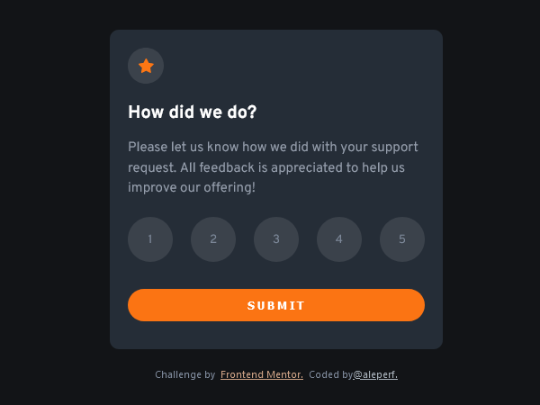
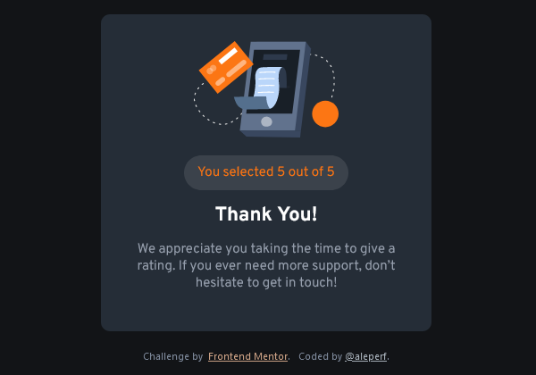
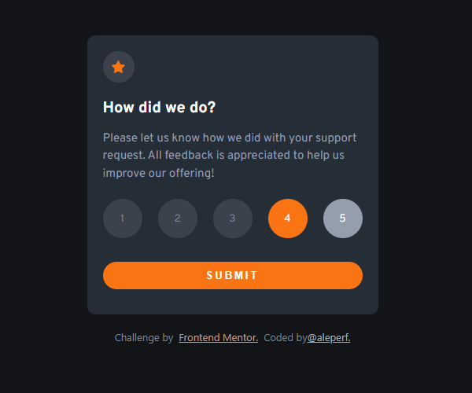
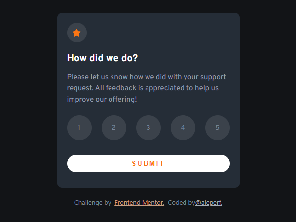
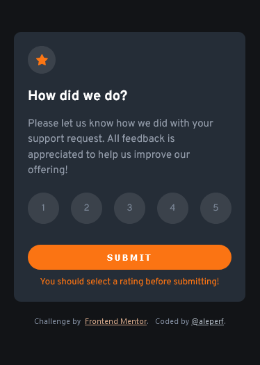

# Frontend Mentor - Interactive rating component solution

This is a solution to the [Interactive rating component challenge on Frontend Mentor](https://www.frontendmentor.io/challenges/interactive-rating-component-koxpeBUmI).

The challenge consists in build a rating card for submitting a rating from 1 to 5.

After submitting the rating, the card transforms into a Thank You card showing the rating submitted.

## Table of contents

- [Overview](#overview)
  - [The challenge](#the-challenge)
  - [Screenshot](#screenshot)
  - [Links](#links)
- [Built with](#built-with)
- [Author](#author)

## Overview

### The challenge

Users should be able to:

- View the optimal layout for the app depending on their device's screen size
- See hover states for all interactive elements on the page
- Select and submit a number rating
- See the "Thank you" card state after submitting a rating
- User should not be able to submit a rating, if no rating button has been selected.

### Screenshots

- Initial State
  

   
   

- Thank You State
   

   
   

- Rating Selected and Rating Button Active State

 
 

- Submit Button Active State

- Error State (Attempt to submit without selecting a rating)

### Links

- Solution URL: [interactive rating component code on github](https://github.com/aleperf/interactive-rating-component)
- Live Site URL: [Interactive Rating Component Github Page](https://aleperf.github.io/interactive-rating-component)

### Built with

- HTML5 and SCSS (using SASS)
- [React](https://reactjs.org/) - JS library
  styles
- Mobile-first workflow

## Author

- Github - [aleperf](https://github.com/aleperf)
